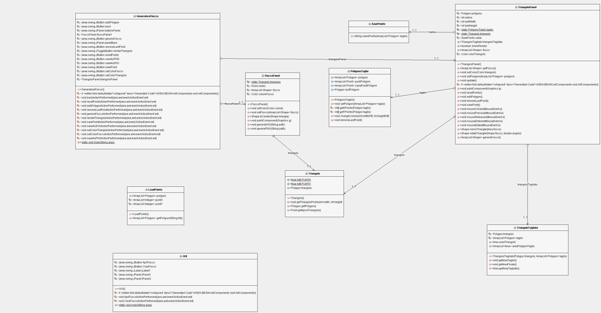

1. [Introduzione](#introduzione)

  - [Informazioni sul progetto](#informazioni-sul-progetto)

  - [Abstract](#abstract)

  - [Scopo](#scopo)

1. [Analisi](#analisi)

  - [Analisi del dominio](#analisi-del-dominio)
  
  - [Analisi dei mezzi](#analisi-dei-mezzi)

  - [Analisi e specifica dei requisiti](#analisi-e-specifica-dei-requisiti)

  - [Use case](#use-case)

  - [Pianificazione](#pianificazione)

1. [Progettazione](#progettazione)

  - [Design dell’architettura del sistema](#design-dell’architettura-del-sistema)

  - [Design dei dati e database](#design-dei-dati-e-database)

1. [Implementazione](#implementazione)

1. [Test](#test)

  - [Protocollo di test](#protocollo-di-test)

  - [Risultati test](#risultati-test)

  - [Mancanze/limitazioni conosciute](#mancanze/limitazioni-conosciute)

1. [Consuntivo](#consuntivo)

1. [Conclusioni](#conclusioni)

  - [Sviluppi futuri](#sviluppi-futuri)

  - [Considerazioni personali](#considerazioni-personali)

1. [Sitografia](#sitografia)

1. [Allegati](#allegati)

## Introduzione

### Informazioni sul progetto

  Questo progetto é stato affidato dai professori Luca Muggiasca e Geo Petrini della SAMT (Scuola d'Arti e Mestieri di Trevano) alle classi I3AA e I3AC, nel quale sono presente pure io Daniel Josef Matt.
  Il progetto ci é stato consegnato il 07/09/2019 e dovrebbe essere consegnato il 20/12/2019, dopo le vacanze natalizie ci saranno le presentazioni su questo progetto.  

### Abstract
  Da bambini tutti abbiamo provato durante il tempo invernale di riprodurre con un foglio di carta spieghezzato e un forbice con la punta accuminata di creare il fiocco di neve piú complesso che avessimo mai visto.
  Questo progetto non é altro che un'evoluzione di quell'ambizione di un dettagliato ma stupendo fiocco di neve che avevamo da bambini, solamente che questa volta non utilizzeremo piú un pezzo di carta o una forbice, ma un programma scritto in JAVA12 che da un triangolo, che raffigura il foglio di carta piegato, incideremo poi dei punti che formeranno 1 o piu poligoni la cui area verra "tagliata" via dal triangolo. 
  Dopo la fase di taglio si potrà vedere il fiocco di neve creato dalla traslazione, che rappresenta la riapertura di un normale foglio di carta, del triangolo.

### Scopo

  Lo scopo di questo progetto, oltre a quello di realizzare un nuovo applicativo, é quello di farci imparare come si gestisce un progetto (progettazione e implementazione).

## Analisi

### Analisi del dominio
Il prodotto finale verrà utilizzato da utenti ai quali piace fare lavori manuali come creare fiocchi di neve con la carta. Quindi non avranno un'ampia conoscenza informatica e per questo l'applicativo deve essere user frendly.

### Analisi e specifica dei requisiti
Per questo progetto ci sono stati dati questi requisiti da rispettare: 
|ID         |Requisito          |Categoria      |Priorità | Versione|
|-----------|-------------------|---------------|---------|---------|
|001|Applicativo in Java|Linguaggio     |1        |1        |
|002|Sito del progetto|Presentazione/Descrizione progetto|4|1|
|003|Il sito non deve avere colori fastidosi|struttura sito|6|1|
|004|Il sito deve contenere una piccola guida di utilizzo con degli screenshots, i requisiti del sistema, la JRE|struttura sito|6|1|
|005|Implementare interfaccia grafica| programmazione |1|1|
|006|Finestra all'avvio dimensioni minime di 1024x768|layout applicazione|4|1|
|007|Area di lavoro é un triangolo. dimensioni 50% rispetto alla finestra|area lavoro|1|1|
|008|Il triangolo deve essere sempre centrato.|layout applicazione|3|1|
|009|Triangolo é ridimensionabile.|layout applicazione|4|1|
|010|Tagli del triangolo con il mouse Left Button| Logica applicativo |1|1|
|011|I punti di taglio possono avere la forma di uno o piú poligoni.|logica applicativo|1|1|
|012|I punti del triangolo si possono resettare.|Logica applicativo|4|1|
|013|I punti di taglio possono essere spostati o rimossi.|Logica applicativo|7|1|
|014|Il/I poligono/i di taglio devono poter essere salvati o in file o DB. (Consigliato in JSON, CSV o serializzazione oggetto). con anche una miniatura|logica applicativo|6|1|
|015|Tasto di generazione del fiocco di neve prodotto che mostra un'anteprima.|Logica applicativo|1|1|
|016|Generazione in tempo reale sin dal l'inizio oppure quando vuole l'utente|logica applicativo|4|1|
|017|Possibilità di salvare il fiocco di neve in PNG o SVG (scelta dell'utente).|logica applicativo|4|1|
|018|Salvare il fiocco di neve con dimensioni correnti (finestra applicativo) o 500 o 1000.|logica applicativo|4|1|
|019|Il percorso di salvataggio puo essere di default ma meglio se lo sceglie l'utente.|logica applicativo|4|1|
|020|Consegna .jar sul sito e il .class su github.|logica applicativo|6|1|

**Spiegazione elementi tabella dei requisiti:**

**ID**: identificativo univoco del requisito

**Requisito**: breve descrizione del requisito

**Categoria**: Indica la categoria del requisito e le conoscenze che bisogna avere per completare questo reauisito

**Priorità**: indica l’importanza di un requisito nell’insieme del
progetto, definita assieme al committente. Ad esempio poter disporre di
report con colonne di colori diversi ha priorità minore rispetto al
fatto di avere un database con gli elementi al suo interno. Solitamente
si definiscono al massimo di 2-3 livelli di priorità.

**Versione**: indica la versione del requisito. Ogni modifica del
requisito avrà una versione aggiornata.

Sulla documentazione apparirà solamente l’ultima versione, mentre le
vecchie dovranno essere inserite nei diari.

### Use Case

### Pianificazione
Gantt Preventivo:

Gantt Consuntivo:

### Analisi dei mezzi

<ul>
  <li>Hardware: ASUS X556UAM</li>
  <li>Sistema Operativo usato: Windows 10 Home</li>
  <li>Software Gantt: Project Libre</li>
  <li>Ambiente di sviluppo: NetBeans 11.1</li>
  <li>Linguaggio usato per la documentazione per Documentazione: MarkDown</li>
  <li>Linguaggio prorammazione: Java 13.0</li>
  <li>Librerie Java: Batik 2.0</li>
  <li>Hosting: Infomaniak</li>
  <li>Html,Css,Javascript</li>
</ul>

## Progettazione

L'applicativo si aprira con un <a href="../imgs/GUI.JPG">menú</a> che offre la scelta di <a href="../imgs/ApriEScegliFile.JPG">aprire</a> un fiocco gia esistente per poi caricarlo nel pannello con il <a href="../imgs/Triangolo.JPG">triangolo</a> dove si potrà aggiungere altri poligoni di taglio e poi <a href="../imgs/FioccoGenerato.JPG">generare</a> il fiocco.

### Design dell’architettura del sistema

### Design dei dati e database

Il progetto da la possibilita di salvare i fiocchi di neve su files ".csv". Su sito del progetto sono a dispoizione alcuni fiocchi di neve già generati.

### Design delle interfacce
Gui:

Triangolo:

Fiocco:

## Implementazione

## Definizione Classi
<ul>
  <li><b>GUI</b>: questa classe rappresena un frame iniziale che offre la possibilita di aprire o di creare un nuovo fiocco di neve tramite 2 pulsanti. Se si preme il primo, aprire, si aprirà una finestra di dialogo che permetterà di aprire file di tipo csv o xls. Mentre se si preme il secondo si aprirà il frame della classe GeneratoreFiocco</li>
  <li><b>GeneratoreFiocco</b>: questa classe é un frame che contiene 2 pannelli: uno che rappresenta il triangolo da tagliare (TriangoloPanel) e un'altro che, invece, rappresenta il fiocco (FioccoPanel) di neve generato. Sotto questi 2 pannelli ci sarà un menú di pulsanti utili alla realizzazione del fiocco.</li>
  <li><b>TriangoloPanel</b>: questa classe si occupa di disegnare un oggetto Triangolo e a ogni click del mouse aggiungere un punto a un oggetto PoligonoTaglio.</li>
  <li><b>Triangolo</b>: rappresenta un modello di triangolo con dimensioni pari al 50% rispetto all'area della finestra che lo contiene.</li>
  <li><b>PoligonoTaglio</b>: rappresenta un modello di poligono di taglio. Si occupa di ridimensionare tutti i punti di tutti i poligoni di taglio ogni volta che il panel viene ridimensionato</li>
  <li><b>TriangoloTagliato</b>: si occupa di sottrarre le aree dei poligoni di taglio all'area del trioangolo di base.</li>
  <li><b>SavePoints</b>: si occupa di salvare tutti i punti dei poligoni di taglio su un file CSV nel seguente formato: x,y x,y x,y . (Per indicare che é finito un poligono)</li>
  <li><b>LoadPoints</b>: si occupa di caricare nell'applicativo un file con il fiocco di neve già esistente. Se il file non rispetta le convenzioni stabilite aprirà il frame GeneratoreFiocco senza aprire nessun fiocco.</li>
  <li><b>FioccoPanel</b>: é un pannello che disegna il fiocco di neve generato al centro del pannello.</li>
</ul>

## Generazione Fiocco

## Test

### Protocollo di test

|Test Case      | TC-001                               |
|---------------|--------------------------------------|
|**Nome**       | |
|**Riferimento**|REQ-012                               |
|**Descrizione**|Import a card with KIC, KID and KIK keys with no obfuscation, but not shown with the GUI |
|**Prerequisiti**|Store on local PC: Profile\_1.2.001.xml (appendix n\_n) and Cards\_1.2.001.txt (appendix n\_n) |
|**Procedura**     | - Go to “Cards manager” menu, in main page click “Import Profiles” link, Select the “1.2.001.xml” file, Import the Profile - Go to “Cards manager” menu, in main page click “Import Cards” link, Select the “1.2.001.txt” file, Delete the cards, Select the “1.2.001.txt” file, Import the cards |
|**Risultati attesi** |Keys visible in the DB (OtaCardKey) but not visible in the GUI (Card details) |

### Risultati test

Tabella riassuntiva in cui si inseriscono i test riusciti e non del
prodotto finale. Se un test non riesce e viene corretto l’errore, questo
dovrà risultare nel documento finale come riuscito (la procedura della
correzione apparirà nel diario), altrimenti dovrà essere descritto
l’errore con eventuali ipotesi di correzione.

### Mancanze/limitazioni conosciute

L'applicativo non presenta una live fluida come richiesto ma per aggiornare il fiocco bisogna aggiungere il poligono di taglio con il pulsante <b>Add Polygon</b>. Inoltre la generazione dell'immagine raster del fiocco avviene con dimensioni già definite dal programma e non si puó cambiare.

## Consuntivo

Non ho rispettato la pianificazione iniziale e mi sono ritrovato a fare tante cose le ultime settimane di lavoro

## Conclusioni

Quali sono le implicazioni della mia soluzione? Che impatto avrà?
Cambierà il mondo? È un successo importante? È solo un’aggiunta
marginale o è semplicemente servita per scoprire che questo percorso è
stato una perdita di tempo? I risultati ottenuti sono generali,
facilmente generalizzabili o sono specifici di un caso particolare? ecc

### Sviluppi futuri
  In futuro si puó implemetare la possibilità di passare le dimensioni dell'immagine raster con per esempio un label. Poi si puó modificare la live e renderla piú fluida.

### Considerazioni personali
  Da questo progetto ho imparato che la documentazione essendo una parte fondamentale di un progetto la si bisogna fare man mano che il progetto va avanti e non come ho fatto io che mi sono ritrovato a fare tutto nelle ultime settimane.

## Bibliografia

### Sitografia

1.  URL del sito (se troppo lungo solo dominio, evt completo nel
    diario),

2.  Eventuale titolo della pagina (in italico),

3.  Data di consultazione (GG-MM-AAAA).

**Esempio:**

-   http://standards.ieee.org/guides/style/section7.html, *IEEE
    Standards Style Manual*, 07-06-2008.

## Allegati

Elenco degli allegati, esempio:

-   Diari di lavoro

-   Codici sorgente/documentazione macchine virtuali

-   Istruzioni di installazione del prodotto (con credenziali
    di accesso) e/o di eventuali prodotti terzi

-   Documentazione di prodotti di terzi

-   Eventuali guide utente / Manuali di utilizzo

-   Mandato e/o Qdc

-   Prodotto

-   …
